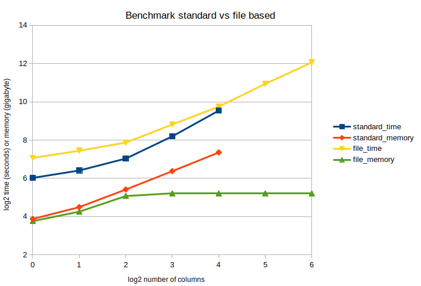

# qnorm
[](https://badge.fury.io/py/qnorm)
[](https://anaconda.org/conda-forge/qnorm)


Quantile normalization made easy! This tool was developed as the current (Python) implementations scattered across the web do not correctly resolve collisions/ties in the ranks. Properly resolving rank ties is important when ties happen frequently, such as when working with discrete numbers (integers) in count tables. This implementation should be relatively *fast*, and can use multiple cores to sort the columns and tie-resolvement is accelerated by numba.

## Code example

We recreate the example of [Wikipedia](https://en.wikipedia.org/wiki/Quantile_normalization):

```python
import pandas as pd
import qnorm

df = pd.DataFrame({'C1': {'A': 5, 'B': 2, 'C': 3, 'D': 4},
                   'C2': {'A': 4, 'B': 1, 'C': 4, 'D': 2},
                   'C3': {'A': 3, 'B': 4, 'C': 6, 'D': 8}})

print(qnorm.quantile_normalize(df, axis=1))
```

which is what we expect:

```
         C1        C2        C3
A  5.666667  5.166667  2.000000
B  2.000000  2.000000  3.000000
C  3.000000  5.166667  4.666667
D  4.666667  3.000000  5.666667
```

Qnorm accepts an (optional) axis argument, which is used to normalize along. If axis=1 (default), standardize each sample (column), if axis=0, standardize each feature (row).

**note**: The function quantile_normalize also accepts numpy arrays. 

### Multicore support

To accelerate the computation you can pass a ncpus argument to the function call and qnorm will be run in parallel:

```python
qnorm.quantile_normalize(df, ncpus=8)  
```

### Normalize onto distribution

You can also use the `quantile_normalize` function to normalize "onto" a distribution, by passing a target along to the function call. 

```python
import pandas as pd
import qnorm

df = pd.DataFrame({'C1': {'A': 4, 'B': 3, 'C': 2, 'D': 1},
                   'C2': {'A': 1, 'B': 2, 'C': 3, 'D': 4}})

print(qnorm.quantile_normalize(df, target=[8, 9, 10, 11]))
```

With our values now transformed onto the target:

```
     C1    C2
A  11.0   8.0
B  10.0   9.0
C   9.0  10.0
D   8.0  11.0
```

## How fast is it and what is its memory usage?

How better to measure this than a little benchmark / example? For this example we will consider 100 replicates, each consisting of one million integer values between 0 and 100, which should give us plenty of rank ties. 

```python
import numpy as np
import qnorm


test = np.random.randint(0, 100, size=(1_000_000, 100), dtype=np.int32)

qnorm.quantile_normalize(test, ncpus=4)
```

```console
user@comp:~$ /usr/bin/time --verbose python small_qnorm_script.py |& grep -P "(wall clock|Maximum resident set size)"

Elapsed (wall clock) time (h:mm:ss or m:ss): 0:07.52
Maximum resident set size (kbytes): 2768884
```

It takes only 7.5 seconds to initialize our table and quantile normalize it. I think that's **pretty fast**!

The test array we made consists of `100 * 1.000.000 = 100.000.000` single point precision integers, so four bytes each (400.000.000 bytes, 0.4 gigabytes). The memory footprint of our script is 0.27 gigabytes, around 7 times our input. Unfortunately that makes qnorm **a bit memory hungry**, but that should not be a problem in 99% of the cases. If memory usage is a problem take a look at the [low-memory implementation](#memory-efficient-quantile-norm).

### Scaling of ncpus

Using more than four cpus generally does not lead to a much bigger speedup. 


### memory efficient quantile norm

In case you want to quantile normalize excessively large tables, there is a "memory-efficient" implementation. This implementation gets its memory efficiency by calculating the mean "online", which means we calculate it on fractions of the total table and then update the value. The other change is that intermediate results are written to disk. Since disk space is slower than memory, this automatically means that this implementation is slower than the standard implementation. However the memory efficient method can scale to virtually infinitely large tables (or until you run out of disk space).

```python
import qnorm

qnorm.quantile_normalize_file("intable.csv", "outtable.csv", rowchunksize=1000, colchunksize=64, ncpus=4)
```

The `rowchunksize` and `colchunksize` respectively influence in how large of chunks the output is written to disk and how many columns are being sorted and quantile normalized at the same time. The larger the better, however the defaults should be sufficiently fast.

And the proof is in the pudding, so again a little benchmark. We make tables which again contains samples which consist of 1 million integers integer values between 0-100. These tables consist of `[10, 20, 40, 80, 160, 320, 640, 1280, 2560, 5120]` columns and in our benchmark we read those files from disk, quantile normalize the tables, and write them to disk both with the standard and memory efficient method (default col and row chunksizes):



At the end the timings become a bit messy, but I think that might be related to the fact that I ran this benchmark on a shared server and other people were running their analyses as well. As you see the file based quantile normalization method is a bit slower (1.5 - 2 times), but has a constant memory footprint.

**note:** Both methods should produce identical results, and neither is more correct than the other.

**note:** The memory-efficient implementation requires pandas to be installed (`conda/pip install pandas`)/

## Command Line Interface (CLI) example

Qnorm also contains a CLI for converting csv/tsv files. The CLI depends on pandas, but this is an optional dependency of qnorm. To make use of the CLI make sure to install pandas in your current environment as well!


```console
user@comp:~$ qnorm --help

usage: qnorm [-h] [-v] table

Quantile normalize your table

positional arguments:
  table          input csv/tsv file which will be quantile normalized

optional arguments:
  -h, --help     show this help message and exit
  -v, --version  show program's version number and exit
```

And again the example of [Wikipedia](https://en.wikipedia.org/wiki/Quantile_normalization):

```console
user@comp:~$ cat table.tsv
        C1      C2      C3
A       5       4       3
B       2       1       4
C       3       4       6
D       4       2       8

user@comp:~$ qnorm table.tsv
        C1      C2      C3
A       5.666666666666666       5.166666666666666       2.0
B       2.0     2.0     3.0
C       3.0     5.166666666666666       4.666666666666666
D       4.666666666666666       3.0     5.666666666666666
```

**note:** the qnorm cli assumes that the first column and the first row are used as descriptors, and are "ignored" in the quantile normalization process. Lines starting with a hashtag "#" are treated as comments and ignored.

**note:** The CLI requires pandas to be installed (`conda/pip install pandas`)

## Installation

### pip

```console
user@comp:~$ pip install qnorm
```

### conda

Installing qnorm from the conda-forge channel can be achieved by adding conda-forge to your channels with:

```console
user@comp:~$ conda config --add channels conda-forge
```

Once the conda-forge channel has been enabled, qnorm can be installed with:

```console
user@comp:~$ conda install qnorm
```

### local

clone the repository

```console
user@comp:~$ git clone https://github.com/Maarten-vd-Sande/qnorm
```

And install it

```console
user@comp:~$ cd qnorm
user@comp:~$ pip install .
```
